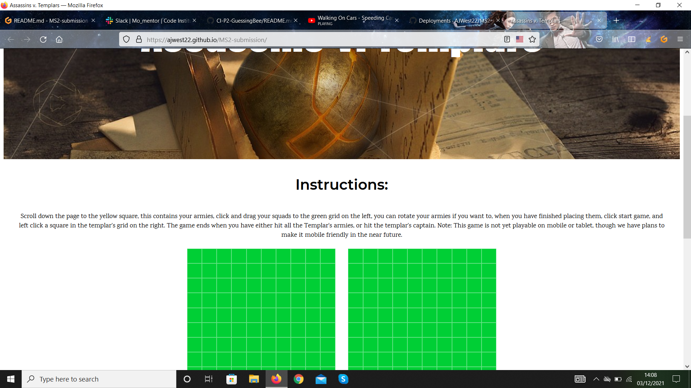
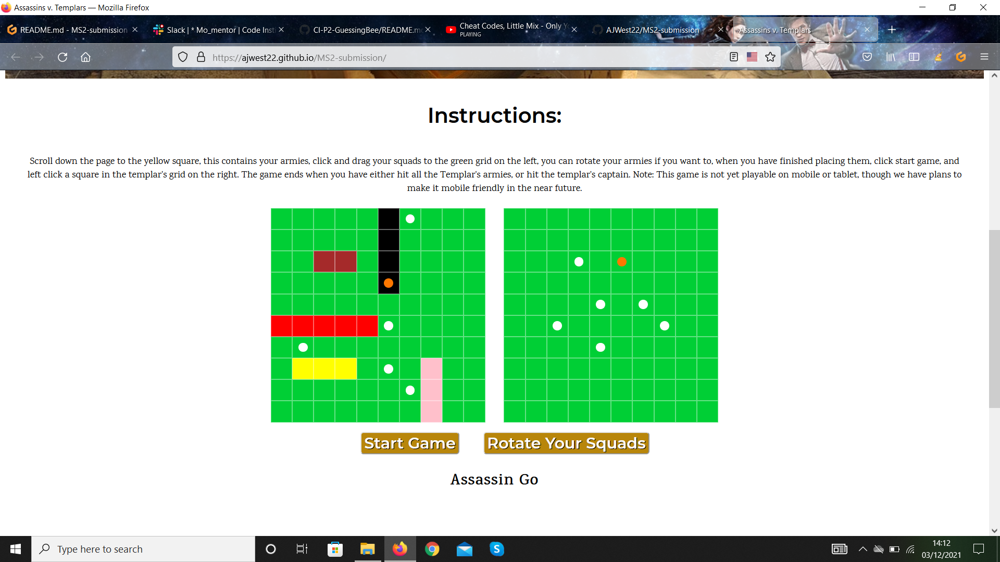
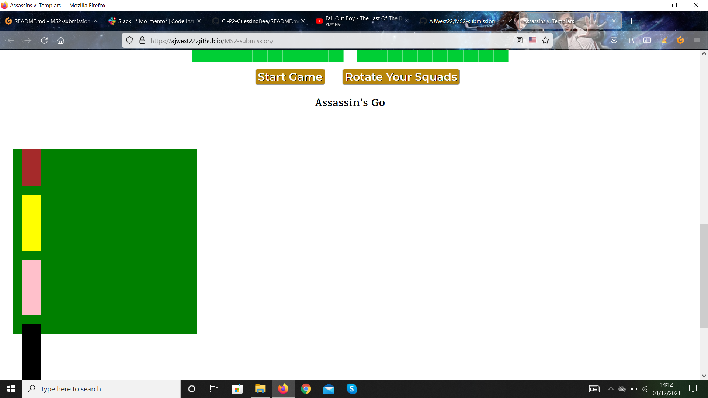
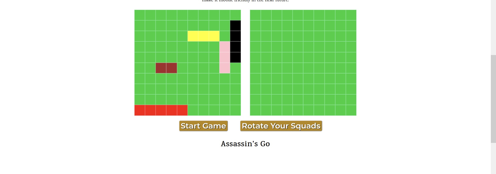
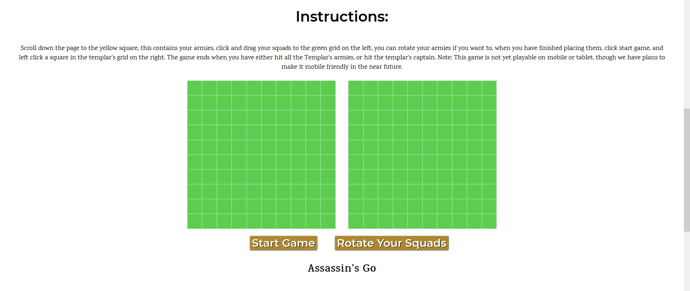
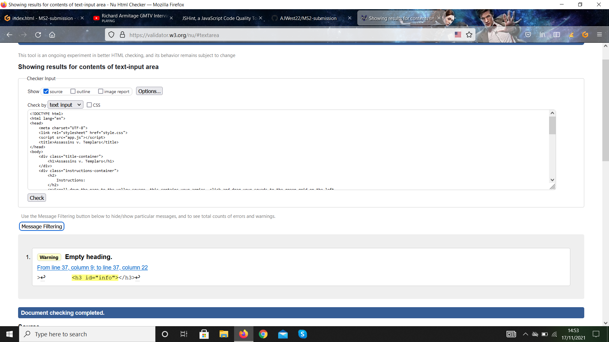
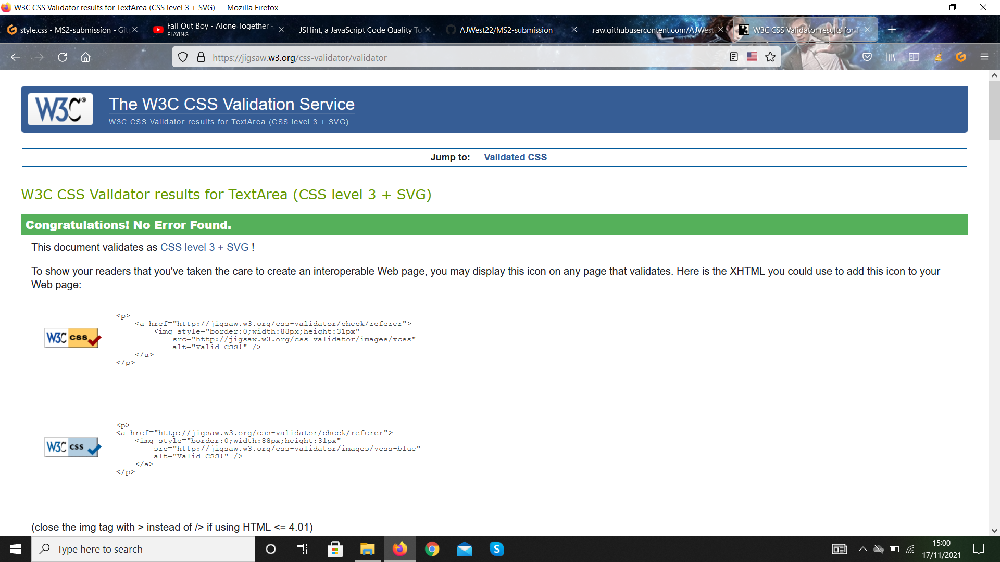
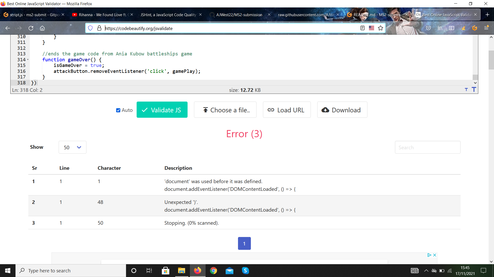

# MS2-submission

## Table of Content

1. [Overview](#overview)

2. [Site Goals](#site-goals)
    1. [UX Goals](#ux-goals)
    2. [Siteowners Goals](#siteowners-goals)
    3. [User Stories](#user-stories)
    4. [User Stories Testing](#user-stories-testing)

3. [About The Site](#about-the-site)
    1. [Target Audience](#target-audience)

4. [Code Used](#code-used)
    1. [JavaScript Logic](#javascript-logic)
    2. [HTML and CSS](#html-and-css)

5. [Design](#design)
    1. [Typography](#typography)
    2. [Colors](#colors)
    3. [Images](#images)

6. [Features to be Added](#features-to-be-added)

7. [Testing](#testing)
    1. [HTML Validation](#html-validation)
    2. [CSS Validation](#css-validation)
    3. [JavaScript Validation](#javascript-validation)
    4. [Browser Compatibility](#browser-compatibility)
    5. [Devices Tested On](#devices-tested-on)

8. [Credits](#credits)
     1. [Sources](#sources)
     2. [Imagery](#imagery)

9. [Acknowledgements](#acknowledgements)

## **Overview**
 
The game is inspired by the popular video game series Assassin's Creed, and Battleships. Assassin's Creed is about the age old war between the Assassin's and their enemies the Templars. In the video game Assassin's Creed Rogue, the player can capture forts, and loot treasure/supplies from them. This provided inspiraton for the idea of capturing forts in a Battleships inspired format: You take a shot at hitting the computer's (templar's) fort and then the computer has a go at hitting your (assassin's) fort. (Unlike in the game where to capture the fort the player must sneak in and not be spotted while fullfilling quests) This game has its roots in a YoutTube tutorial I found, I found JavaScript incredibly tough to get to grips with, and was in no way able to write something for a MileStone project, hence why I used the youtube video, which can be found in the credits, as the basis for this project. 

[Link to site](https://ajwest22.github.io/MS2-submission/)

## **Site Goals**

### UX Goals

- Users can play the game
-  The user wants to play a decent and fun game
-  The user wants to see a aesetically appealling site with good gameplay
- The user wants a game that is easy to understand and play

### Siteowner's Goals

- Create a game users can enjoy
- The site owner wants a game that makes users come and play again
- The site owner wants to make a game that is easy to play and understand
- The site owner wants the game to have good graphics ad visualls, so it is aesetically pleasing

### User Stories

 - As a user I want a game that is easy to understand
 - As a user I want to know whether my shot was successfull or not
 - As a user I want the ability to rotate my armies so I can place them successfully
 - As a user I want the ability to layout my armies on my grid 
 - As a user I want the game to be easily playable.

### User Stories Testing 

Testing 1: As a user, I want a game that is easy to understand

| **Feature** | **Action** | **Expected Result** | **Actual Result** |
|-------------|------------|---------------------|-------------------|
| Start screen | Has instructions on how to play | User can read and understand the game| Works as expected |

Screenshots

Testing 2: As a user I want to know whether my shot was successfull or not

| **Feature** | **Action** | **Expected Result** | **Actual Result** |
|-------------|------------|---------------------|-------------------|
| Game screen |Click the square you want shoot at | The hit will turn either orange or white depending on whether its a hit or not | Works as expected |

Screenshots

Testing 3: As a user I want the ability to rotate my armies so I have an alternative way of placing them

| **Feature** | **Action** | **Expected Result** | **Actual Result** |
|-------------|------------|---------------------|-------------------|
| Game screen | Click rotate squads button | The armies rotate depending on whether the button has been clicked or not | Works as expected |

Screenshots

Testing 4: As a user I want the ability to place my armies on my grid

| **Feature** | **Action** | **Expected Result** | **Actual Result** |
|-------------|------------|---------------------|-------------------|
| Game screen | Click and drag an army to the grid | The armies can be placed on the squares, except the outer ones, this is to stop them wrapping around and appearing half on one side of the grid and half on the other | Works as expected 

Screenshots

Testing 5: As a user I want the game to be easily playable

| **Feature** | **Action** | **Expected Result** | **Actual Result** |
|-------------|------------|---------------------|-------------------|
| Game screen | Read Insturctions | The instructions are easy to understand | Works as expected 

Screenshots

## About the Site
- The site has a total of 1 page currently.
 - Users can play as the Assassin's.
 - Object of the game is to hit the Templar's Armies.
 - Users can rotate their armies

### Target Audience
 - The site is aimed and adults/young adults who are interested in either Assassin's Creed or BattleShips.
 - The site is also aimed at people who enjoy games.

## **Code Used**

### JavaScript Logic

The JavaScript game logic was the hardest to make. As two forts are needed with grids on them. Each grid is 10 x 10, so has 100 squares in them. To create these squares a for loop was used to create the grid's individual squares, by passing in the parameters 'grid and squares' the code when run creates squares inside the width of the grid (i < width* width keeps it within the specified area{hence the width * width with the variable width set to 10 to make it equal 100}) To create each individual sqaure, 'createElement ('div) is used with each div being an individual square. The const square is equal to every square in the grids, and has an id of i, each time it loops and creates a sqaure, the sqaure has a number of 1 - 100, which comes from the i < width * width. The use of appendChild puts the sqaure into the assassinsGrid and templarsGrid where it can then be assigned a number 1 - 100. Push is used to push a sqaure into the sqaure variable.

The armies are stored as objects in an array, this makes them easily acccessible, when getting them to generate randomly in the Templar's fort. 

The randomPosition variable is set to Math.floor and Math.random to get a random number, that is then multiplied by the armies directions (from the armiesArray) and the .length to get the length of the array. The use of Math.abs, Math.random, and Math.floor ensures that the armies are placed in the grid on a square, and not half way across one or only 3/4 of the way across. The variable templarSquares is used to keep the army generating randomly inside the Templar's fort and ensures it doesn't go outside, alongside the .length Javascript, the position variable (which sets the size of the grid for the templarArmies to generate in) and the directions variable which dictates the size each army will be.

Let current is used to assign a random army, by taking the army and its directions from the armiesArray and its randomPosition to generate it in its random position.

The Math.random is used in the randomStart variable again, to assign a random square in the computers grid. To ensure the ships dont to go to close to the edge of the board, subtracting the army directions and length keeps them more in the center. 

Index is used to go through the armyArray, and get the names and directions of the armies.

To make sure an army isnt placed again in a sqaure thats already got an army in it, the variable isLost is used alongside the templarSqaures variable, if it contains an army, the class 'lost' is assigned and an army wont be placed there.

The variables isAtRightHandSide and isAtLeftHandSide stop an army generating too far to right or left and side and then wrapping around to appear on the opposite side. So if a army like knights that is 4 divs long, generates too close to left hand side, for example 2 sqaures away from the left hand side, the remaining 2 divs won't appear on the right hand side of the grid. The remainder modulus width takes the current army (the one that is generating randomly at that point) and divides it by the width, if its remainder is equal to 9, then the army will generate further away from the edge of the grid. 

The if statement on line 86, is used to check if the condions are true, so if its not at the right or left hand edge, and it doesnt have the class of 'lost', it can generate an army from the army array there, as the squares are free, if it does, then the class of 'lost' can then be added, and the next army can be generated.

The rotate function is used to rotate the player's ships around. The classList.toggle feature is used to toggle between the different class names, depending if its horizontal or not. It has to be in twice otherwise the console will always log isHorizontal as false, which is not ideal, as sometimes isHorizontal will be true, and can result in bugs. 

The players armies are draggable and placeable on the board. This is done using the dragStart function. The armies const collects all the armies together, combined with the event listener to make the armies ready and prepped for dragging. By taking the army class from the generate army function and the square class from the createBoard function, the armies are able to be selected and placed onto the individual squares. Each army has an eventlistener tied to the 'mousedown' functionality so that when the army is clicked on, it activates and can be ready to be dragged to the grid. Most functions use the preventdefault function to tell the computer not to run that function. However the dragDrop function is used to let the computer know where the player has dragged and dropped their armies, and ensure it can't be placed outside the grid. 

DraggedArmy variable is used to contain all the sqauds/armies and their divs. lastChild.id is used to get the last id of that army's div. Slice is used to rmeove the last part of the army id so you end up with just the name of the army. This means that instead of logging 'templars-1' or 'templars -5', it should log 'templars'. 

childNodes is used to go into the dragged army and look at all of its nodes, and however many nodes it has assign them to the draggedArmy.length. To get the future square where the last element in the dragged army is going to be in, dataset.id is used, to get the id of that square. To get just the id, the lastArmyIndex variable is used to equal the armyNamewithLastId variable, and substr(-1) to take off whatever the last item in the string is. This is the lastArmyIndex, and is going to be a string, because its going to be added to the index of the grid (0-99) it needs to be a number rather than a string, so ParseInt is used to get the number for lastArmyIndex. 

So now lastArmyIndex has been defined (ie if its knights its going to be 3, or templars is going to be 4) it needs to be added to the dataset id in the grid, so you know exactly where and what location the last element of the army is going to be in. In order to add it to the dataset id of the grid, armyLastId is used to add lastArmyIndex to the dataset.id, parseInt is used again to ensure it is a number and not a string. 

To know you have selected an army/squad, you have the selectedArmyIndex which is the army/squad you pick. In order to get the selectedArmyIndex the selectedArmyNameWithIndex.substr(-1) is used to get the last item of the string and throw it back to the user again. ParseInt is used again to make it a number. 

To get the length of the army, so for example using supplies, at index no.1, its then needed to know that the end of the army is only one square ahead, not two. This is needed to know if the army is at the left or the right hand side of the grid. To achieve this armyLastId  - selectedArmyIndex is used to get the last id and the selectedArmyIndex. So that wherever the last id is, is where the army is landing. 

If the army is horizontal in shape, a for loop is used to loop over the entire army so however nodes it has to render it in the assassinsGrid. The class of the army is added in the armyClass variable, and assassinsSquares is accessed and dataset id is passed through, then the classList is added and the armyClass so no mater which army is chosen, the army length and the army name class is set, and can be used to drag and drop the army into the grid. -selectedArmyIndex is used to if a user picks an army up towards the middle or far end of the army, it will still render and be drag and droppable. 

If the army is vertical, another for loop is used but so that it doesn't go by 1, each time, otherwise it would end up going 1,2,3, instead width is needed each time. As width is set to 10, 10 is added again and again and again, so its rendering square 9, square 19, onwards up to 99. 

The remove child function at the bottom ensures the army that has been dragged is removed fromthe grid display area and has been placed on the board.

To stop the army from running to far to the left or right, and appearing on the opposite side, so for example the knights is placed to close to the edge, 1 square shows on the left, and 3 appear on the right side, some squares aren't available to place your armies in. So selectedArmyIndex is not allowed to be in the squares at the edge, otherwise it will spill over, and render play unplayable. The variables const notAllowedHorizontal and Let newNotAllowedHorizontal = notAllowedHorizontal.splice(0, 10 * lastarmyIndex)  and notAllowedvetical and nowNotAllowedVertical dictate what squares an army can't be placed in. 

For the gamePlay itself, a gamePlay function is made. Currently isGameOver is set to false, so the game plays, when this is false, the player takes their turn. Each square has a click event listener on it, so when the player clicks a square, it turns over and reveals either a hit or a miss, using the revealGrid function. If it is the computer's go, the computer as 1 second, set using the timeout, to take a shot. and it will display templarsGo in the info heading under the buttons. 

 The revealGrid function used to show if a hit has been successful or not. If the square that has been hit contains a: lookoutpost, footsoldiers, supplies, knights or templars, 1 shot is added to the count. If the square contains a an army, the classList of 'lost' is changed to 'hit' if none of the above are true, then the class is changed to 'missed'. A checkWins function is then called and run to check for any wins that might have occured during the turn, the current player is changed to 'templar' and the gamePlay function is called to keep the game in play if the check for wins function hasn't found anything.
 
 for the templar's go function, the class names were changed slightly to make it so that they were representative of the Templar army. The function runs similarly to the revealGrid function, with some alterations. The random variable, is used to take a shot at the assassinsGrid by assigning a random grid number for it to hit. The if statement is used to determine along with the const hit variable, to determine if a hit has been successsful or not. If it is a hit, the class hit is added, if its not a hit, the class missed is added. If the hit has been successfull the army that has been hit, is added by one. So if the knights have been hit two times, they have been added two times, to make 2 successfull hits. After the computer has taken its turn, the checkWins function is called again, if it doesn't find anything, then the player switches to assassin.
 
 The function checkwins is used to check if any notable events have taken place. So for example, has the supplies been hit? If its equal to 3 (has been hit 3 times) then the text will display 'you destroyed the templar's supplies', and the player wins 30 points. There are a total of 150 points up for grabs, the first to 150 points wins, and the system should display the winner.
 
 Once the winner has been declared, the function gameOver is called, and it removes the attack button from the screen, and calls for the gamePlay function for the game to start again.
 

 ### HTML and CSS
 
- Flexbox was used to style and align the grids, and the items in the hidden-info container, the buttons and  whose go and win message. 

- Spacing has been added to make the items more spaced out, which helps create a modern look and feel to the site. The spacing has been set to em, to make the site responsive. Example would be the grids, which have been set to 'margin-top: 8em', which give the grids some space between them and the instructions container.

- Divs have been used to keep the site's contents in their own containers, which helps keep everything aligned and spaced evenly. It also makes it more legible and easy to read and see which parts of the site are contained where.

- Classes and IDs have been used to target elements individually, this means they can be aligned and sltyled using CSS and Flexbox, to keep the site looking clean.

## **Design**

### Typography

There are 3 fonts used in this site: Anton, Montserrat, and Karma.

- Anton is used in the H1 of the header image. It is used to help create a eye catching header image, and works well as a header font as it is quite thick in terms of depth, and tall in terms of height, which akes the image stand out. The font is also in line with the feel of the game and the original games BattleShips and Assassin's Creed games.  The white text contrasts with the gold of the image, text-shadow was originally attempted to be added, but the text-shadow didn't show, even with the cache cleared, and site saved.

- Montserrat is used in the H2 of the instructions container, it's purpose is to create a header that is in contrast with the Anton font in the header image, while still looking decent and in-keeping with the syle of the original game materials and the style of the site. Montserrat does this nicely, and gives off the effect of looking ike it could come from a treasure map, which is in keeping with the header image and Anton font. 

- Karma font is used in the instructions container, it helps with creating the flow of the site and the feel of the site. Its smaller size is in contrast to both the headers, and this creates a modern text effect, that flows with the top 1/3 of the site. The font also has a kind of rugged look and feel to it, which gives off an old treasure type of feel, which is in-keeping with the header image. 

### Colours

The colours of the site are mainly gold, which is in keeping with capturing the fort, and getting the treasure/loot of the fort. 

- The hexcodes for the site are: #b8860b for the buttons, and #ffd700 for the buttons on hover. This gold effect is used to keep the flow of the site continuous, and in-keeping with the Assassin's Creed games. 

- The grids are currently a green colour, this was the original colour and was updated to Gold at one point, but when this was rolled out across the site, the computer's (templar's) armies could be seen for some reason, so it had to stick as green: #00cf35. At some point I would like to fix this and ammend the colour style, as at the minute it jarrs and dissrupts the flow of the site.

- The army squads are set to a various colour depending on their size, so player's have a way of distinguishing them. At some point I would like to add a label so when player's hover over them an id flashes up showing which army squad is which. 

### Images

- There is currently only one image on the site the header image. The header image depeicts one of the treasures of the Assassin's Creed Games, it was found on Pixabay, you can find it [here.](https://pixabay.com/photos/eden-edenapfel-edensplitter-1200379/)
I chose this image because it helps capture the atmosphere of the Assassin's Creed games. 

## **Features to be Added**

There are several features I would like to add to develop this game and make it more my own: a captain, ids for the army squads, a counter, levels of difficulty, improved computer AI, a timer, making the game unable to be played without the squads being placed first. 

- Captain: I would like to add a single div called the captain, this would be made of just one div, and if hit, it would end the game immediately. 

- IDs for the squads: Currently the squads are hard to distinguish, so I would like to add a nametag to the squads divs, so this way the player can see what they picking up and dragging.

- Counter: I'd like to add a counter for the player's ammo. So a player has only a limited number of shots per game, and if they run out the game ends and they fail. The same concept would apply to the templar's computer.

- Timer: I'd also like to add a timer, so a player has a limited time frame to take a shot, if they don't shoot in the allotted time frame, the computer will shoot randomly for them. 

- Levels of Difficuly: Currently its quite easy to win the game, so I would like to add various levels of difficulty with increased computer AI, and fewer arrows/ammo. 

- Increased AI: The AI is very basic at the moment, I would like to research how to increase the AI of the computer, currently the squads are close together, so having the squads placed further apart would make them harder to hit, and improved accuracy of the computer's shots. 

- Button Fixes: Currently a player can play the game without placing their squads. At some point I'd like to make the game so player's get a notification reminding them to place their armies before playing, and the game is unplayable until they are all placed.

## Testing

All code has been tested in several validators, including: [W3C MarkUp Validation Service](https://validator.w3.org/), [W3C CSS Validation Service](https://jigsaw.w3.org/css-validator/), and [Code Beautify](https://codebeautify.org/jsvalidate).

### HTML Validation

The HTML code was tested using W3C MarkUp Validation Service, there was one error, which was the h3 tag with the id of "info", this cannot be easily corrected though, as this header is used to display alternating messages, for example whose go it is, and the winner of the game. 

HTML Validation

  

### CSS Validation

The CSS code was tested using W3C CSS Validation Service, and there were no errors found.

CSS Validation

  

### JavaScript Validation

The JavaScript code was tested using Code Beautify, the code was found to have a few errors as shown, I'm unsure how to fix them, and they weren't flagging up in the IDE.

JavaScript Validator

  

### Browser Compatibility

This site has been tested on the following browsers:
- FireFox
- Safari
- Microsoft Edge

### Devices Tested On

This site has been tested on: laptop 15", iPad 8th gen, iPhone SE (2016) and iPhone SE (2020).

 ## **BUGS**
 
 - There are several knonw bugs. The first is that sometimes a square may not reveal when clikced on and the computer takes its turn. I'm not sure why this is, i have checked the code and the source code for tis game, and cannot find anything untoward with the clickeventlisteners. This bug is one I have encountered, but no one else who has played this game has. I am recording it here, should anyone else get it. 
 
 - The second bug is that sometimes the text doesn't display the winner, so the game doesn't end until all squares are hit, and it still won't declare the winner. Personally I haven't had this bug, but some people who have played this game tell me they have had it. I added the checkWins function to the templarsGo function, as it wasn't in there but was in the revealgrid function, this hopefully has fixed it, but I'm recording it here as well, in case it hasn't.
 
 - The 3rd bug is you can start the game without placing your armies. This is something I haven't had time to add, but is something I want to add in the future at a later date and when my skills have improved enough for me to work out a concrete solution to this problem. 
 
 - The 4th bug, is armies can be placed on top of each other, again i haven't had time to fix this, and its something I want to add when my skills have again improved and I can build and develop this project further. 
 
 - The 5th bug, is clicked to fast causes the computer to go into overwhelm, and it will take multiple shots at the assassin's grid. So if you click on the computer's grid 5x fast, the computer will get confused whose go it is, and will take more than 5 shots at the player. This is something Im not sure how to fix, and is again something I'd like to work on when my skills have reached a higher level.
 
 - The 6th bug: If you click start game, and haven't placed your armies yet then the computer will take two shots instead  of one, I'm not sure why this is, but it is something i am going to look at in the future development of this game to improve my skills.

 ## **Credits**
 
 The source code for this game can be found here: https://www.youtube.com/watch?v=U64vIhh0TyM 
 
 And the HTML and CSS here: https://www.youtube.com/watch?v=G6JTM-zt-dQ 
